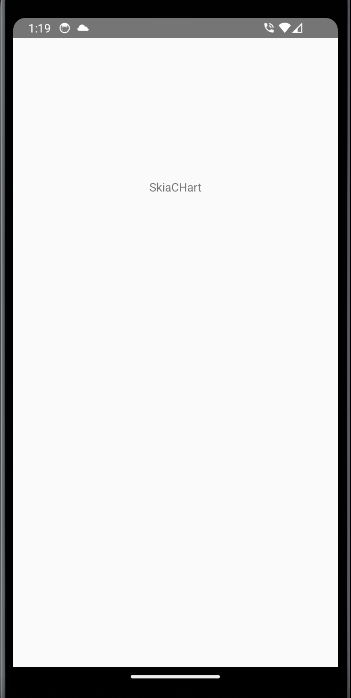
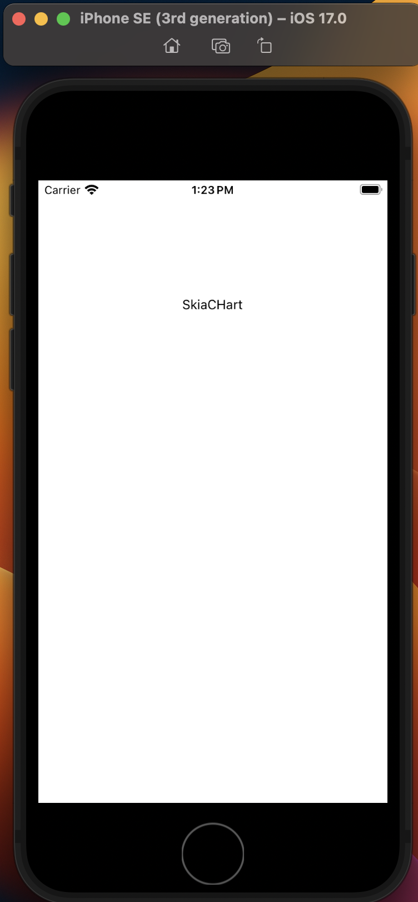

# This is a minimal reproduction of rendering problem of react-native-echarts

**Describe the bug**
Nothing will be rendered if zrender version is not same as the echarts' zrender version.

## Screenshots

**To Reproduce**
Steps to reproduce the behavior:
1. Create fresh react-native project.
2. Follow "Getting Started→Installation" but use npm instead of yarn
3. Do exactly as "Write a simple line chart"
4. No any graph will be displayed.

**Expected behavior**
Graph should be rendered.

**Desktop (please complete the following information):**
 - OS: Mac M1 Ventura 13.4

**How to Solve the problem**
1. use yarn

or

2. specify the dependent zrender version in package.json
if echarts version is 5.4.1, you need to add zrender 5.4.1  
if echarts version is 5.4.2, you need to add zrender 5.4.3